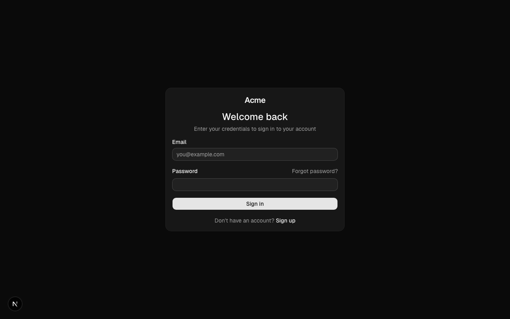
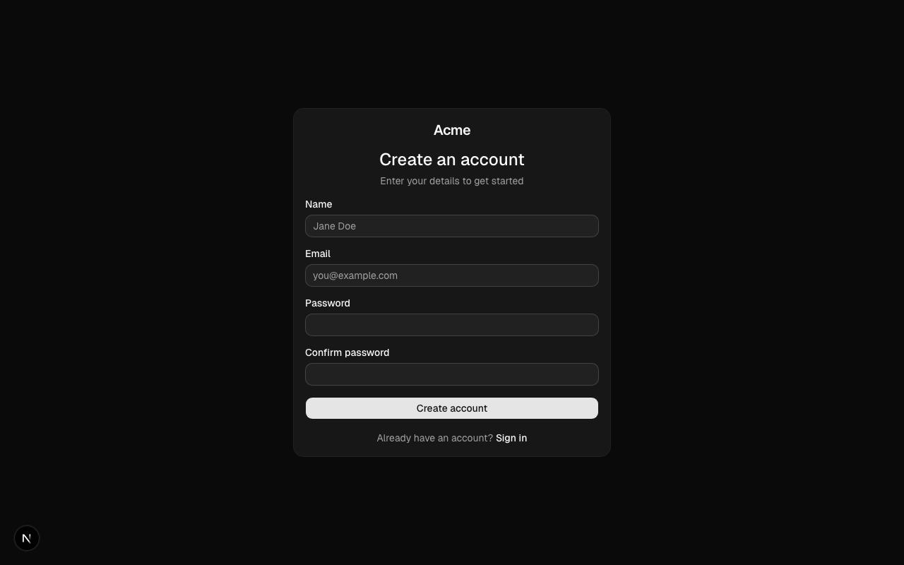
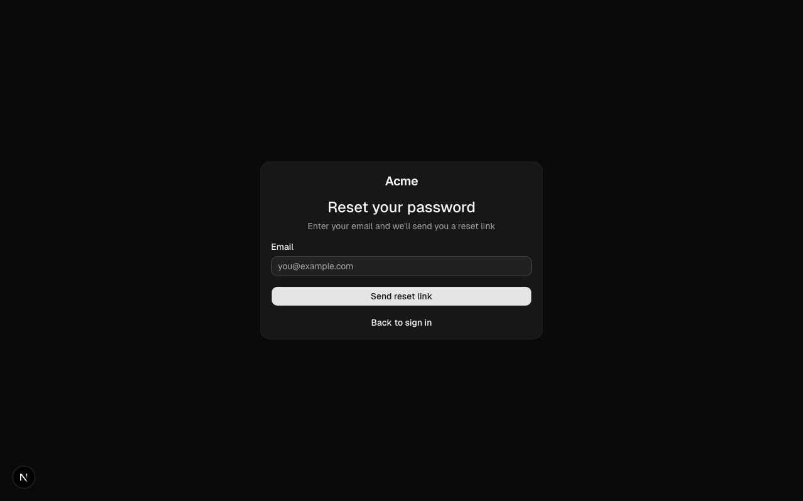
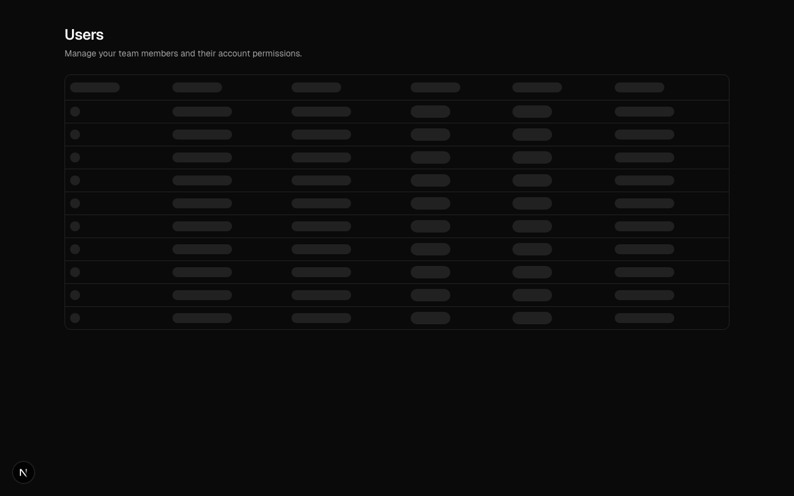
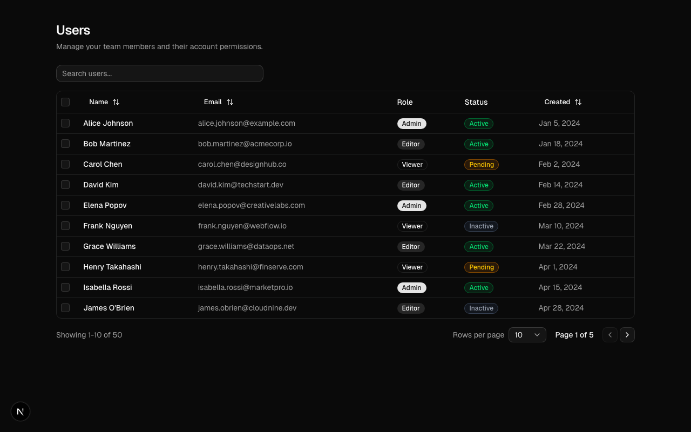
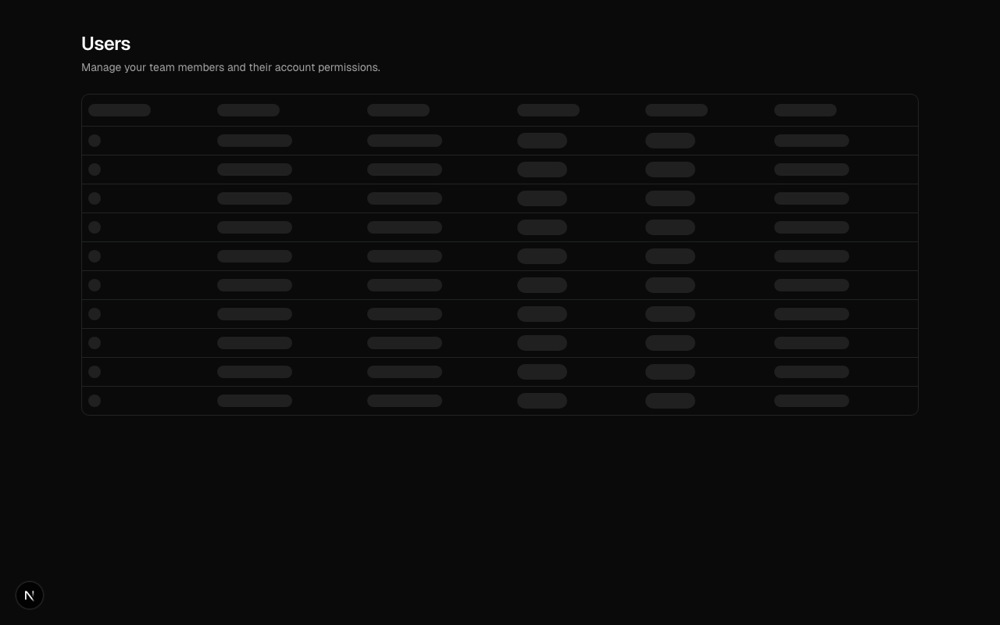

# agent-ready-shadcn-starter

> Ship AI-generated UI without shipping AI-generated mistakes.

[](LICENSE)
[](CONTRIBUTING.md)

**[Live Demo](https://agent-ready-shadcn-starter.vercel.app)**

---

## Why this exists

AI can generate UI fast. But only 68.3% of AI-generated projects execute out of the box. Models are better at generation than verification. Consistency drifts across multi-file changes. Accessibility, error states, and edge cases are afterthoughts.

This is not a starter kit. It is a **hardening framework** — a system for turning AI-generated code into production-safe features.

## The five pillars

1. **Scaffold** — Generate feature structure with specs, state matrices, and prompt templates (`pnpm turbo gen feature`)
2. **Spec** — Define every state, validation rule, and acceptance criterion before generating code
3. **Instruct** — Give agents structured prompts with project context, not vague one-shot requests
4. **Evaluate** — Score output on accessibility, type safety, state coverage, and consistency ([`/quality`](https://agent-ready-shadcn-starter.vercel.app/quality))
5. **Repair** — Compare AI output against production code, document every fix ([`/compare`](https://agent-ready-shadcn-starter.vercel.app/compare))

## What's inside

- **Before/after repair viewer** — Side-by-side diffs showing what AI got wrong and how it was fixed
- **Quality dashboard** — Real scores per example: accessibility, types, state coverage, tests
- **State matrices** — Every feature specifies all 10 states (loading, empty, error, offline, etc.)
- **Feature scaffold CLI** — `pnpm turbo gen feature` creates spec, state matrix, prompt, and review template
- **Reproducibility CI** — Every push verifies fresh install, build, tests, and route rendering
- **Production review checklists** — Checklist-driven review for accessibility, types, states, and consistency
- **Reusable prompt packs** — Structured agent instructions, not just "generate a login form"
- **Golden examples** — Auth flow and dashboard table with full spec → implement → review cycle

## Quick start

```bash
git clone https://github.com/reckziegelwilliam/agent-ready-shadcn-starter.git
cd agent-ready-shadcn-starter
pnpm install
pnpm dev
```

| Service | URL |
|---------|-----|
| Web (Next.js) | http://localhost:3000 |
| API (NestJS) | http://localhost:4000 |

## Feature examples

| Example | Status | Description |
|---------|--------|-------------|
| Auth Flow | Done | Login, signup, forgot password with validation |
| Dashboard Table | Done | Sortable, filterable, paginated data table |
| Settings Page | Planned | Tabs, toggles, form save state |
| Multi-step Wizard | Planned | Step validation, progress indicator, review step |
| Optimistic CRUD | Planned | Create/edit/delete with optimistic updates and rollback |
| File Upload | Planned | Drag and drop, preview, progress tracking |

Each example includes a **spec**, a **prompt pack**, the **final implementation**, and **review notes** showing what the AI got wrong and how it was corrected.

## Screenshots

### Auth Flow

| Login | Signup | Forgot Password |
|-------|--------|-----------------|
|  |  |  |

### Dashboard Table

| Loading State | Loaded |
|---------------|--------|
|  |  |

### Feature Demos




## Repo structure

```
agent-ready-shadcn-starter/
├── apps/
│   ├── web/                        # Next.js 16 frontend
│   │   ├── app/                    # App router pages
│   │   │   ├── (auth)/             # Auth route group (login, signup, forgot-password)
│   │   │   └── dashboard/          # Dashboard pages
│   │   ├── components/             # Feature-specific React components
│   │   │   ├── auth/               # Auth form components
│   │   │   └── dashboard/          # Dashboard UI components
│   │   ├── features/               # Redux slices (feature-based state)
│   │   │   └── auth/               # Auth slice with RTK
│   │   ├── hooks/                  # Custom React hooks
│   │   ├── lib/                    # Utilities, store config, mock data
│   │   │   ├── store/              # Redux store setup
│   │   │   └── mock-data/          # Development mock data
│   │   └── package.json
│   └── api/                        # NestJS 11 backend
│       └── src/
│           ├── auth/               # Auth module, controller, service
│           ├── health/             # Health check endpoint
│           ├── app.module.ts       # Root module
│           └── main.ts             # Entry point
├── packages/
│   ├── ui/                         # Shared shadcn/ui component library
│   │   └── src/
│   │       ├── components/         # shadcn/ui components (button, input, etc.)
│   │       ├── hooks/              # Shared hooks
│   │       ├── lib/                # Utility functions (cn, etc.)
│   │       └── styles/             # Global CSS with Tailwind v4
│   ├── prompts/                    # Reusable AI prompt packs
│   │   └── general/               # General-purpose prompts
│   ├── specs/                      # Feature specifications
│   ├── review-checklists/          # Production review checklists
│   ├── eslint-config/              # Shared ESLint configuration
│   └── typescript-config/          # Shared TypeScript configs
├── examples/                       # Complete feature examples
│   ├── auth-flow/                  # Auth: spec + prompts + review notes
│   ├── dashboard-table/            # Data table: spec + prompts + review notes
│   ├── settings-page/              # (planned)
│   ├── multi-step-wizard/          # (planned)
│   ├── optimistic-crud/            # (planned)
│   └── file-upload/                # (planned)
├── docs/                           # Documentation
├── public/                         # Static assets
│   ├── screenshots/                # Feature screenshots
│   └── demo-gifs/                  # Demo recordings
├── turbo.json                      # Turborepo pipeline config
├── pnpm-workspace.yaml             # pnpm workspace definition
└── package.json                    # Root package with turbo scripts
```

## Prompt packs

Reusable prompts for AI coding agents. These are not just "generate a login form" -- they provide structured context, step-by-step implementation instructions, and verification criteria.

| Pack | Purpose |
|------|---------|
| `packages/prompts/general/` | General-purpose prompts for common patterns |
| `examples/auth-flow/` | Auth-specific prompts with form validation context |
| `examples/dashboard-table/` | Data table prompts with sorting/filtering context |

Each prompt pack includes:

1. **System context** -- tech stack, conventions, file locations
2. **Implementation steps** -- ordered tasks with acceptance criteria
3. **Verification checklist** -- what to check before considering it done

## Production review rubric

After AI generates code, run it through these checklists:

- **Accessibility** -- ARIA labels, keyboard navigation, focus management, screen reader support
- **States** -- Loading, empty, error, success, partial data, offline
- **Types** -- Strict TypeScript, no `any`, discriminated unions for state
- **Responsive** -- Mobile-first, breakpoint testing, touch targets
- **Performance** -- Bundle size, re-renders, memoization, lazy loading
- **Security** -- Input sanitization, CSRF, auth checks, rate limiting

See [`docs/production-review-rubric.md`](docs/production-review-rubric.md) for the full rubric.

## Tech stack

| Technology | Version | Purpose |
|------------|---------|---------|
| Next.js | 16 | React framework with App Router |
| React | 19 | UI library |
| shadcn/ui | latest | Component primitives |
| Tailwind CSS | v4 | Utility-first styling |
| Redux Toolkit | 2.x | State management |
| React Hook Form | 7.x | Form handling |
| Zod | 3.x | Schema validation |
| NestJS | 11 | Backend API framework |
| Turborepo | 2.x | Monorepo build system |
| pnpm | 9.x | Package manager |
| TypeScript | 5.9 | Type safety |

## Philosophy

AI-assisted development works best when you:

1. **Start with a clear spec.** Define what you are building before asking the agent to build it.
2. **Give the agent structured context.** File paths, conventions, existing patterns, and constraints.
3. **Review output against a checklist.** Not vibes -- a concrete list of production requirements.
4. **Fix patterns, not just symptoms.** When AI gets something wrong, update the prompt so it gets it right next time.

This repo codifies that workflow into something you can clone, use, and extend.

## Contributing

PRs welcome. See [CONTRIBUTING.md](CONTRIBUTING.md) for guidelines on adding feature examples, writing specs, creating prompt packs, and the PR process.

## License

[MIT](LICENSE)
